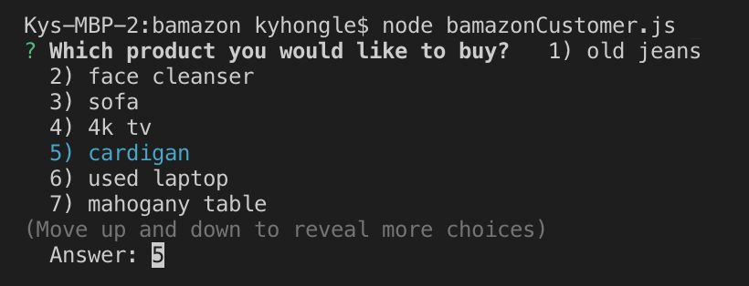
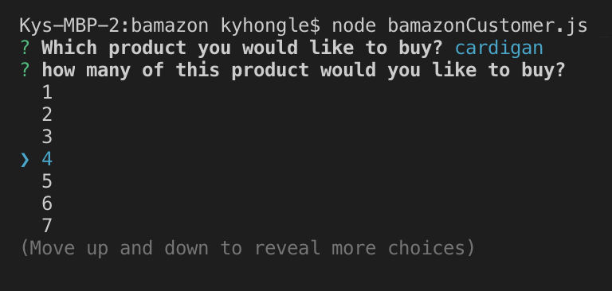
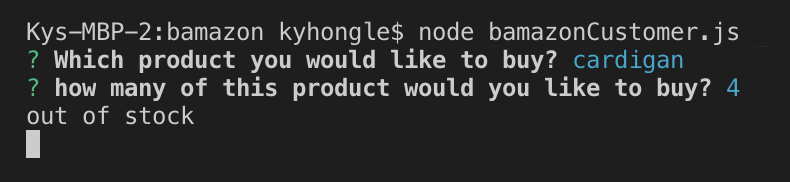
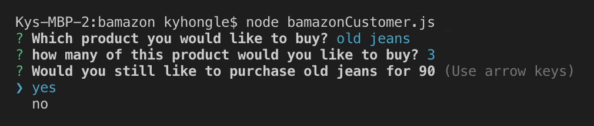
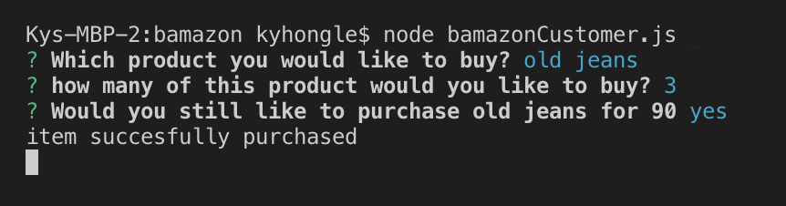
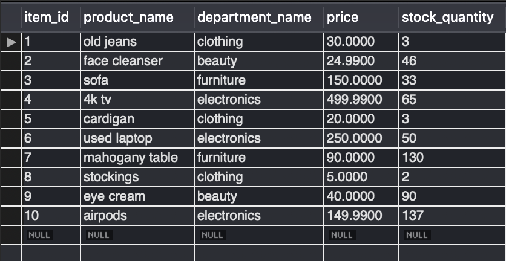

# bamazon

## About this app

This is an app that will list the inventory to the user, allow user to choose and buy the given products.

## How to use the app - Customer Front

    1. Run the app: node bamazonCustomer.js
    

    2. Choose an item from the inventory that's given
    

    3. Then choose how many you want to buy
     

    4. If the product is less than 5, it will notify the user that it's out of stock
     

    5. If the product is still in stock, it will ask the user to confirm the purchase. If user clicks "yes", the purchase is completed
     
      

    6. The inventory will update itself when the user purchased the items in its database
     
